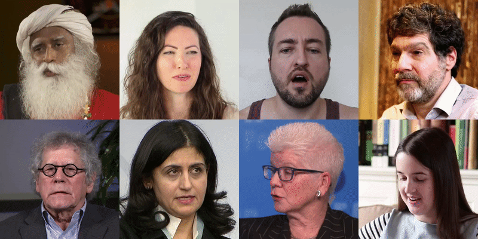

## TalkingHead-1KH Dataset





TalkingHead-1KH is a talking-head dataset consisting of YouTube videos, originally created as a benchmark for face-vid2vid:

> **One-Shot Free-View Neural Talking-Head Synthesis for Video Conferencing**<br>
> Ting-Chun Wang (NVIDIA), Arun Mallya (NVIDIA), Ming-Yu Liu (NVIDIA)<br>
> https://nvlabs.github.io/face-vid2vid/<br>
> https://arxiv.org/abs/2011.15126.pdf

The dataset consists of 500k video clips, of which about 80k are greater than 512x512 resolution. Only videos under permissive licenses are included. Note that the number of videos differ from that in the original paper because a more robust preprocessing script was used to split the videos.
For business inquiries, please visit our website and submit the form: [NVIDIA Research Licensing](https://www.nvidia.com/en-us/research/inquiries/).


## Download
### Unzip the video metadata
First, unzip the metadata and put it under the root directory:
```bash
unzip data_list.zip
```

### Unit test
This step downloads a small subset of the dataset to verify the scripts are working on your computer. You can also skip this step if you want to directly download the entire dataset.
```bash
bash videos_download_and_crop.sh small
```
The processed clips should appear in `small/cropped_clips`.

### Download the entire dataset
Please run
```bash
bash videos_download_and_crop.sh train
```
The script will automatically download the YouTube videos, split them into short clips, and then crop and trim them to include only the face regions. The final processed clips should appear in `train/cropped_clips`.


## Evaluation
To download the evaluation set which consists of only 1080p videos, please run
```bash
bash videos_download_and_crop.sh val
```
The processed clips should appear in `val/cropped_clips`.

We also provide the reconstruction results synthesized by our model [here](https://drive.google.com/file/d/1BX9zaNL_zowTDruvRB3KvebaSUi3WHWc/view?usp=sharing).
For each video, we use only the first frame to reconstruct all the following frames.

Furthermore, for models trained using the VoxCeleb2 dataset, we also provide comparisons using another model trained on the VoxCeleb2 dataset.
Please find the reconstruction results [here](https://drive.google.com/file/d/1HVCFj7WOy9KHP1J76wn-ZExh-nQnff9g/view?usp=sharing).


## Licenses
The individual videos were published in YouTube by their respective authors under [Creative Commons BY 3.0](https://creativecommons.org/licenses/by/3.0/legalcode) license.
The metadata file, the download script file, the processing script file, and the documentation file are made available under [MIT](LICENSE.txt) license. You can **use, redistribute, and adapt it**, as long as you (a) give appropriate credit by **citing our paper**, (b) **indicate any changes** that you've made, and (c) distribute any derivative works **under the same license**.


## Privacy
When collecting the data, we were careful to only include videos that &ndash; to the best of our knowledge &ndash; were intended for free use and redistribution by their respective authors. That said, we are committed to protecting the privacy of individuals who do not wish their videos to be included.

If you would like to remove your video from the dataset, you can either

1. Go to YouTube and change the license of your video, or remove your video entirely.
2. Contact [researchinquiries@nvidia.com](mailto:researchinquiries@nvidia.com). Please include your YouTube video link in the email.


## Acknowledgements
This webpage borrows heavily from the [FFHQ-dataset](https://github.com/NVlabs/ffhq-dataset) page.

## Citation
If you use this dataset for your work, please cite
```
@inproceedings{wang2021facevid2vid,
  title={One-Shot Free-View Neural Talking-Head Synthesis for Video Conferencing},
  author={Ting-Chun Wang and Arun Mallya and Ming-Yu Liu},
  booktitle={CVPR},
  year={2021}
}
```
